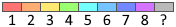

# Provisioning and rendering of OSM protection areas

The main objective of this project is to provide a variety of exports for OSM protection areas with class 14 (i.e. Schutz/Schongebiete in German).

The definition of these areas can be found [here](https://wiki.openstreetmap.org/wiki/DE:Betretungsverbote_für_Gebiete_im_Winter), this wiki contains both the extraction queries as well as the rendering styles.

In order to make the exports more easy to use, the following approach has been taken:

* extraction of all protect_class=14 ways and relations from OSM via an overpass query
* results are loaded into Python which allows a more or less direct copy&paste of the queries form the wiki
* these queries are then applied and produce an "explicit" tagging, i.e. every way or relation gets a tag/property "classification" = type1-type8 for the defined 8 types of protection areas
* the script then produces 3 main output files:
  * **Schongebiete.geojson** with feature properties **classification** tag set to type<1-8> for direct rendering
  * **Schongebiete-ColorStyles.geojson** with feature properties **classification** tag set to type<1-8> for direct rendering, plus
    * style properties for https://geojson.io - only color due to limits of geojson.io styling capabilities
    * 
  * **SchongebieteWays.geojson** with all contained ways (can be used as a layer to visualize access:conditional tags on the ways)
  
## Jupyter notebooks, export files and reference map

In order to simplify testing for changes, the above scripts are provided as Jupyter notebooks. (exported to plain Python scripts for production)
### OSMSchutzgebiete2GeoJSON.ipynb
* see above
### OSMSchutzgebiete.ipynb
* used to track mapping progress, in particular of to be taged ways
* extracts all protect_class=14 ways and relations and contained ways
* output goes into a folium map which can be statically deployed somewhere

The [Reference Map](https://www.xctrails.org/schongebiete/SchongebieteWMSLayer.html) is provisioned by loading the geojson files into a PostGIS database, from where they are picked up by a geoserver instance, which applies the styles (see geoserver directory) and serves the tiles as WMS layer.
